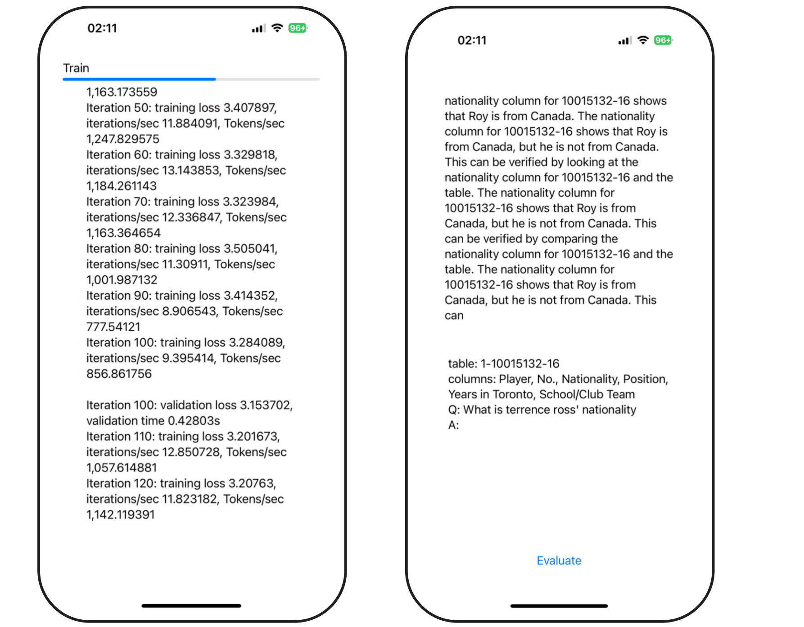
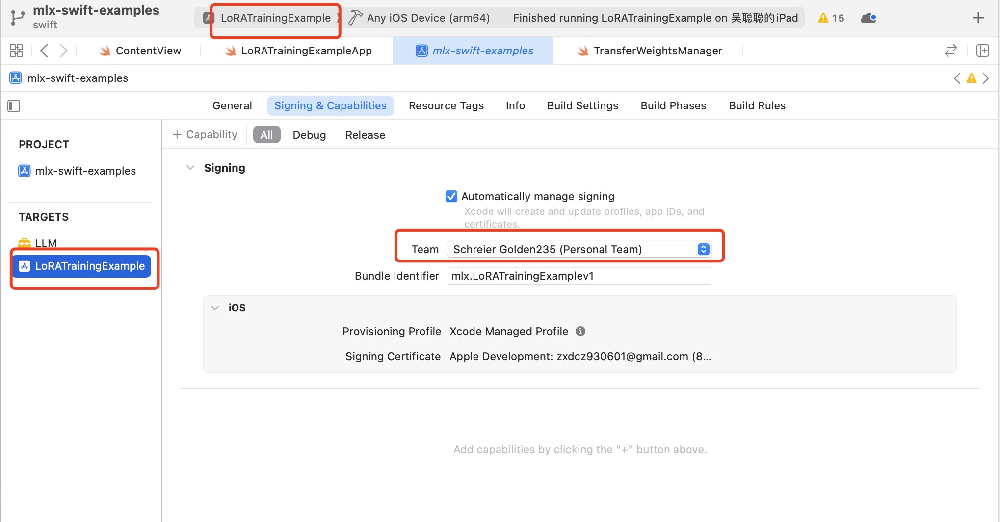
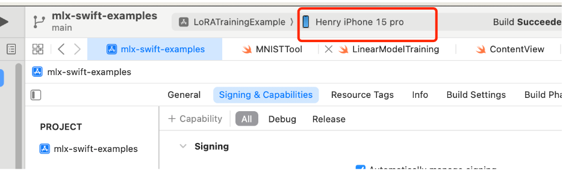
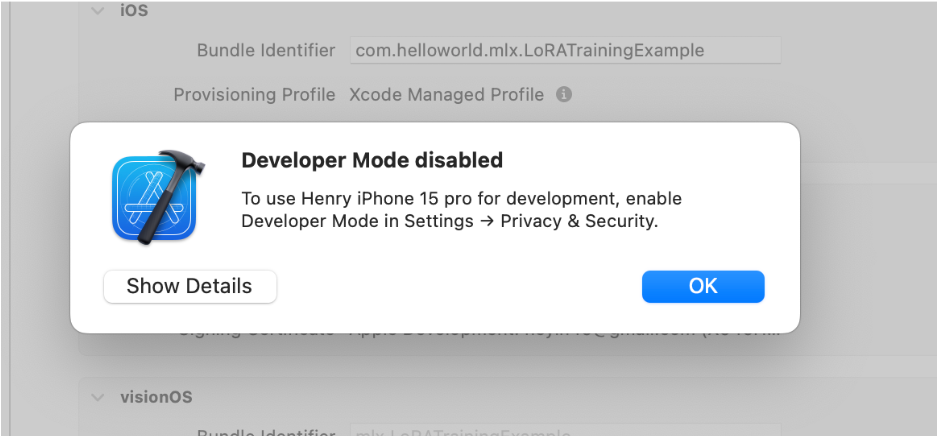
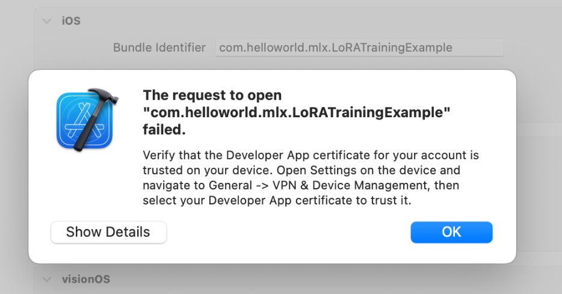
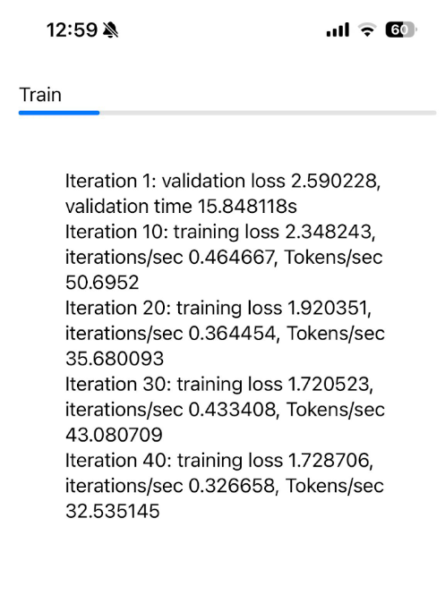

# FLB Mobile Training Guide
 

This project aims to combine training large language models on mobile devices with edge computing to improve the speed and user experience of smart applications. By allowing model training directly on users' phones, we can process data locally, reducing delays and enhancing personalized services.

Using edge computing technology, users can leverage their device's computing power for efficient model training without relying on cloud services. This not only optimizes resource usage but also strengthens data privacy, ensuring users' information is secure. Our solution will drive the widespread adoption of mobile intelligence, meeting users' needs for personalization and real-time interaction.

## Support LLM
[√] Phi-3  
[√] Lama3_1  
[√] smolLM_135M   
[√] mistral7B4bit  
[√] gemma_2  

## Prepare the local environment.

- MacBook Pro: Chip Apple M3 Pro
- Mac System: 14.1 (23B2073)
- Mobile Device: iPhone 15 Pro
- Mobile System: 18.0
- Xcode Version: Version 15.4

## Compile using Xcode.

1. git clone https://github.com/CerboAI/FLB

2. Double-click the `mlx-swift-examples.xcodeproj` file in the directory, and Xcode will open automatically.

3. Add your username and enter your Apple ID. For the Bundle Identifier, enter a custom project name, such as: `com.flb.mlx.LoRATrainingExample`.

4. Connect your iPhone or iPad to the device, as a physical device is required for deep learning purposes.

5. Upon the first run, a password verification prompt will appear, which requires your Mac's startup password. Then, click on "Always Allow."

6. If Developer Mode is not enabled on the phone, enable it as follows:

    To enable Developer Mode on your iPhone, follow these steps:
    - Open the **Settings** app on your iPhone.
    - Scroll down and tap on **Privacy & Security**.
    - Within this section, locate and enable **Developer Mode**.

7. After installing the app, you need to go to "VPN & Device Management" in the settings and trust the app.

8. Upon entering the interface, there will be a **Start** button. After clicking it, the model will be downloaded, which will only occur during the initial setup.

9. After the model has been downloaded, training will commence. Here is a screenshot of the process.

