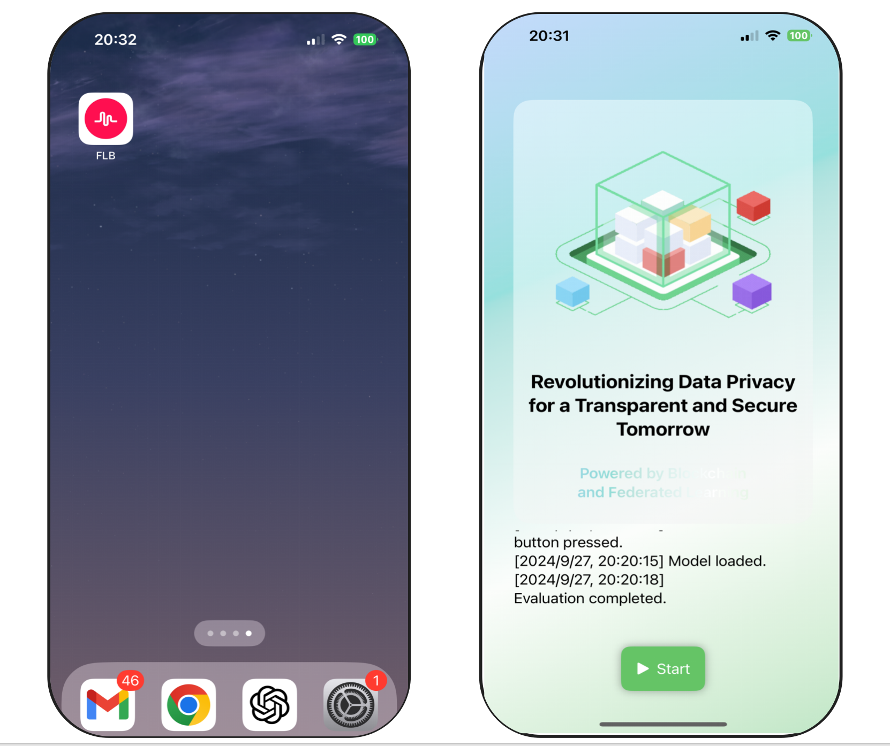

# FLB Mobile Training Guide
 

This project aims to combine training large language models on mobile devices with edge computing to improve the speed and user experience of smart applications. By allowing model training directly on users' phones, we can process data locally, reducing delays and enhancing personalized services.

Using edge computing technology, users can leverage their device's computing power for efficient model training without relying on cloud services. This not only optimizes resource usage but also strengthens data privacy, ensuring users' information is secure. Our solution will drive the widespread adoption of mobile intelligence, meeting users' needs for personalization and real-time interaction.

## Support LLM
[√] Phi-3  
[√] Lama3_1  
[√] smolLM_135M   
[√] mistral7B4bit  
[√] gemma_2  

## Prepare the local environment.

- MacBook Pro: Chip Apple M3 Pro
- Mac System: 14.1 (23B2073)
- Mobile Device: iPhone 15 Pro
- Mobile System: 18.0
- Xcode Version: Version 15.4

## Compile using Xcode.

To Do ....

